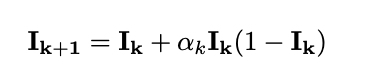

# LLIE-code-retinex

本仓库用于存放基于Retinex先验实现的具有代表性的LLIE方法的实现代码，以及整理此类代码中具有的共同思想。

## Retinex相关代码

## 曲线法

## 无监督损失系列
  ### 亮度一致性损失
    思想： 在训练时随机加入少量正常光照图像，约束网络在增强时尽可能不增强正常光照环境。
  ###   ICLR'25 [DCT先验引导的邻域验码自监督去噪方法 ](https://github.com/huaqlili/unsupervised-light-enhance-ICLR2025)
         --这篇文章简直是将retinex和n2n思想理解到极致了，才能搞出来的顶级缝合文，十分推荐一读。

     大体思想： 1.基于N2N思想设计了自监督去噪模块（思想简述:基于点估计理论，这意味着，在训练去噪网络时，如果用零均值噪声的含噪图像z替代干净图像xi，则使用L2损失的优化结果将等效于采用含噪-干净图像对进行训练的结果。这一假设构成了我们工作的理论基础（这段话不是很理解））。
              2. 以及融合随机伽马调整与retinex理论的自监督增强策略（此处采取伽马变化对1中下采样得到的子图2进行亮度增强，基于retinex理论（同一场景下不同亮度的图像其反射图一致思想）得到两个配对的子图互相监督从而得到反射图R).
              3. 通过dct分解得到各类退化先验，并设计全局学习encoder来从退化中得到隐式退化表征
              4. 基于退化表征设计了混合先验transformer以重建反射图，并自适应增强照度图。
     问题： 复现一直没复现出论文的值，甚至一度出现难以收敛现象，不知道是哪里出了问题。
     论文中提及的损失：
              1. retinex分解损失
                ！[loss1](image/loss1)
              2. 自监督增强损失
                
## HSV通道思想
  将V通道分离后单独进行增强以增强亮度；
  （此处与曲线法类似，会有一个期望平均亮度值作为标签让其学习）。
     ### 大多数平均亮度期望法的思想均来自于LIME,其公式如下图所示：
     
  
